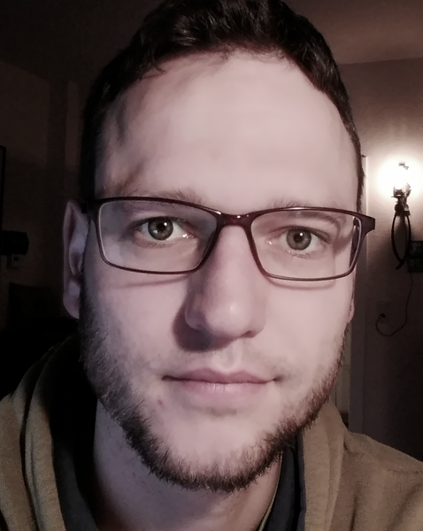

```{r, echo = FALSE, out.width = "30%", fig.align="left"}

```

======================

In jüngster Zeit (seit Ende 2017) beschäftige ich mich privat (wieder) intensiver mit R. Ich halte diese Sprache in Verbindung mit den heute verfügbaren Tools als das Umfangreichst-Eleganteste, was Statistiker / Data Scientists / und vergleichbare Berufs-Ettiketierungen derzeit nutzen können. Alles Open Source und frei verfügbar. Was ich damit alles anstelle, darüber schreibe ich hier. 

Beruflich beschäftige ich mich bei [`IT.NRW`](https://www.it.nrw.de) mit Veröffentlichungsdatenbanken. Das wird ab und an in meiner Beschäftigung mit R auch sichtbar, weil ich öffentlich verfügbare Daten der amtlichen Statistik gern mit R verarbeite. 

Dennoch: Alles was ich hier schreibe, ist rein privater Natur, sprich meine persönliche Meinung und mein persönliches Werk. Nichts, was ich hier schreibe, gibt eine Meinung oder Haltung meines Arbeitgebers wieder. Mehr zu meinem professionellen Profil gibt es auf [`xing`](https://www.xing.com/profile/Lars_Hofmann16) zu erfahren.

Mails werden gern gelesen über `lars[PUNKT]hofmann[AT]posteo[PUNKT]de`. PGP-Mails bitte mit [`diesem Schlüssel`](https://pgp.mit.edu/pks/lookup?op=get&search=0xA61035380ED543EC) verschlüsseln.

Fingerprint: `BB65 421F B2D5 F55D 43A9 EAAF A610 3538 0ED5 43EC`.

Ich betreibe diese Webseiten (kundex.github.io und Subs, github.vom/kundex uns Subs) *ausschließlich* zu privaten Zwecken. Das heißt weil ich Lust darauf habe. Ich biete hier absolut keine geschäftsmäßigen Dienste an. Wer dennoch welche findet, darf sie kostenfrei behalten.

Ich verweise gelegentlich auf externe Ressourcen, die allesamt im R-Kontext stehen und nach meinem menschlichen Ermessen keinerlei rechtswidrige Inhalte enthalten oder enthalten werden. Das trifft natürlich auch auf die originären Inhalte meiner Webseiten zu. Wer rechtswidrige Inhalte hier findet, sollte mich bitte unbedingt anzeigen.